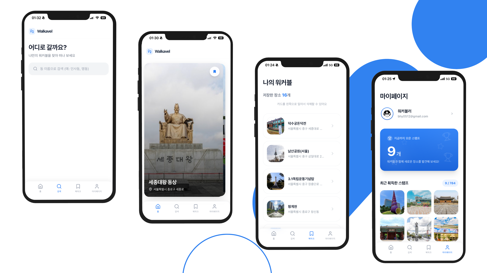

<div align="center">

<h1><span style="vertical-align: middle;">Walkavel (워커블) — Frontend</span></h1>

<p><b>일상이 여행이 되는 순간, 발걸음이 즐거운 여행을 제안합니다.</b></p>
<p>걷기 좋은 여행지를 발견하고 스탬프 미션을 통해 재미를 더해주는 모바일 최적화 웹 서비스.</p>

<p>
  <a href="https://walkavel.vercel.app/"></a>
  <a href="https://drive.google.com/file/d/1Oi6CBBlS4PEIIHEBGks2jYhfqHN6Skfb/view?usp=drive_link"></a>
  <a href="https://youtu.be/BHgrptiKOFI"></a>
  <a href="https://www.figma.com/design/In0GfLVEGlNWgTcizgf5SA/Walkavel?node-id=134-107&t=jsY7b4CEUxSi-1"></a>
  <a href="https://teamwalkerbackend.fly.dev/docs"></a>
</p>

<br/>


</div>

---

## 📑 목차 <!-- omit in toc -->

- [✨ 서비스 소개](#-서비스-소개)
- [📌 Key Highlights](#-key-highlights)
- [👤 FE 담당](#-fe-담당)
- [🛠️ 기술 스택](#️-기술-스택)
  - [🤔 기술적 의사결정](#-기술적-의사결정)
- [📂 프로젝트 구조](#-프로젝트-구조)
- [🚀 시작하기](#-시작하기)
- [🤝 협업 가이드](#-협업-가이드)

---

## ✨ 서비스 소개



### 💡 주요 기능 (Features) <!-- omit in toc -->

#### 📍 걷기 좋은 여행지 추천 (Explore) <!-- omit in toc -->

- 동 이름으로 검색하면 주변 랜드마크를 카드 스와이프로 하나씩 탐색하고, 지도로 위치를 한눈에 확인할 수 있습니다.

#### 🎫 스탬프 획득 미션 (Stamp) <!-- omit in toc -->

- 랜드마크에 실제로 방문하면 스탬프가 자동으로 기록되고 진동 피드백으로 획득을 알려줍니다. 여행지를 직접 발로 걸으며 수집하는 재미를 더해줍니다.

#### 🔖 나만의 여행 보관함 (Bookmark) <!-- omit in toc -->

- 마음에 드는 장소를 저장해두고 언제든 꺼내볼 수 있습니다. 다음 여행 계획을 미리 모아두기에도 좋습니다.

#### 🎨 모바일 최적화 UI/UX <!-- omit in toc -->

- 앱 설치 없이 홈 화면에 추가해 네이티브 앱처럼 사용할 수 있습니다. 네트워크가 불안정한 환경에서도 동작합니다.

---

## 📌 Key Highlights

**1. Geolocation 기반 실시간 위치 추적 및 스탬프 자동 획득** — 수동 인증의 UX 단절을 자동 트리거로 해결

- 🔍 **문제**: 사용자가 직접 방문 인증을 트리거해야 하는 구조로 도보 여행 중 UX 흐름이 끊김
- ✅ **해결**: Geolocation API로 실시간 거리 계산, 반경 진입 시 자동 스탬프 획득 + 시각적 피드백 구현. 바텀시트 수동 재호출 버튼 추가로 예외 상황 대응

**2. 탐색 UX 구조 개선** — 지역 간 이동 불가 문제를 내비게이션 재설계로 해결

- 🔍 **문제**: 특정 지역 탐색 중 다른 지역으로 이동하려면 탐색을 종료해야 하는 UX 구조적 한계
- ✅ **해결**: 하단 내비게이션에 검색 탭 추가 → 탐색 중에도 언제든 다른 지역 검색·전환 가능하도록 흐름 개선

**3. PWA 기반 모바일 웹앱 구축 및 실기기 UI 안정성 확보** — 네트워크 불안정 환경 대응과 iOS 실기기 버그를 함께 해결

- 🔍 **문제**: 도보 여행 중 네트워크 불안정 환경에서의 접근성 보장 필요, iOS 하단 탭과 UI 겹침·깨짐 현상 발생
- ✅ **해결**: `@ducanh2912/next-pwa`로 서비스 워커 캐싱 전략 적용 및 A2HS 구현, CSS `env(safe-area-inset-*)` 적용으로 Safe Area 대응, 480px 고정 레이아웃으로 모바일 UI 안정성 확보

**4. Next.js Proxy 기반 Edge Proxy 구축** — 클라이언트 API 키 노출과 CORS 문제를 서버 레이어로 해결

- 🔍 **문제**: 클라이언트에서 네이버 지도 API 직접 호출 시 API 키 노출 및 CORS 오류 발생
- ✅ **해결**: `proxy.ts`를 Edge Proxy 레이어로 구성하여 인증 세션 갱신·보호 경로 접근 제어·API Proxying을 통합 처리 → 외부 API 키 노출 방지 및 CORS 동시 해결

**5. 팀 개발 환경 기반 구축 및 CI/CD 자동화** — 의존성 충돌 해소와 자동화 파이프라인 구축으로 팀 개발 생산성 확보

- 🔍 **문제**: 보일러플레이트 구성 시 Lint 설정 및 패키지 의존성 충돌로 팀원 간 환경 불일치 발생
- ✅ **해결**: 선행 브랜치 우선 병합 후 의존성 최신화, GitHub Actions 기반 빌드·린트·테스트 CI 파이프라인 구축 → 모든 PR에 빌드·테스트 자동 검증 적용

---

## 👤 FE 담당

<table>
  <tr>
    <td align="center">
      <a href="https://github.com/bhy304">
        
      </a>
    </td>
    <td align="center">
      <b>백하연</b><br /><br />
      😎 팀장<br />FE · Infra
    </td>
    <td>
      • 스와이프 카드 UI · 랜드마크 상세 · 북마크 · 마이페이지 — FE 전체 1인 개발<br />
      • Naver Map API 연동 및 실시간 위치 기반 스탬프 자동 획득 로직 설계<br />
      • 행정구역 기반 지역 검색 및 레이더 UI 컴포넌트 구현<br />
      • iOS Safe Area 대응 및 모바일 실기기 UI 버그 수정<br />
      • Vercel 배포 환경 구축 및 GitHub Actions 기반 CI/CD 자동화
    </td>
  </tr>
</table>

---

## 🛠️ 기술 스택

| Category          | Technology           |
| :---------------- | :------------------- |
| **Framework**     | Next.js 16, React 19 |
| **Language**      | TypeScript 5         |
| **Styling**       | Tailwind CSS 4       |
| **UI Components** | shadcn/ui            |
| **State**         | Zustand 5            |
| **Server State**  | TanStack Query v4    |
| **Form**          | React Hook Form, Zod |
| **Animation**     | Framer Motion        |
| **Auth**          | Supabase Auth        |
| **PWA**           | @ducanh2912/next-pwa |
| **API**           | Orval (자동 생성)    |
| **Testing**       | Jest, Playwright     |

### 🤔 기술적 의사결정

- **Next.js 16** — App Router 기반 SSR/SSG로 비로그인 화면의 SEO 최적화 및 초기 로딩 성능 확보. `proxy.ts`를 Edge Proxy 레이어로 활용하여 인증 세션 갱신, 보호된 경로 접근 제어, API Proxying을 한 곳에서 통합 관리
- **Supabase Auth** — Google·Kakao OAuth 2.0 소셜 로그인 연동, PostgreSQL DB·Auth·Storage를 하나의 BaaS로 통합 관리하여 별도 서버 배포 없이 인증 체계 구축
- **Zustand 5** — Boilerplate 없이 가볍고 직관적인 전역 상태 관리
- **Tailwind CSS 4** — Utility-first 방식으로 디자인 시스템 일관성 유지 및 빠른 스타일 개발
- **shadcn/ui** — 디자이너 부재 상황에서 Radix UI 기반의 접근성(WAI-ARIA) 보장된 UI를 빠르게 구축. 컴포넌트 코드를 프로젝트에 직접 복사하는 방식으로 자유로운 커스터마이징 가능
- **react-hook-form + zod** — Uncontrolled 방식으로 불필요한 리렌더링을 최소화하고, zod 스키마 기반 유효성 검증으로 런타임 에러를 컴파일 타임에 사전 차단. shadcn/ui Form 컴포넌트와 통합되어 일관된 폼 UX 제공
- **@ducanh2912/next-pwa** — 도보 여행 중 네트워크 단절 상황 대응 및 설치 없는 앱 경험 제공
- **Orval + TanStack Query v4** — OpenAPI 스펙 기반 API 코드 자동 생성으로 타입 안정성 확보 및 서버 상태 관리
- **Jest, Playwright** — Jest로 거리 계산·스탬프 획득 트리거 등 핵심 비즈니스 로직 단위 테스트, Playwright로 실제 사용자 흐름 기반 E2E 시나리오 검증

---

## 📂 프로젝트 구조

```bash
├── app/                        # Next.js App Router
│   ├── (auth)/                 # 인증 도메인 라우트 그룹 (Login, Callback)
│   ├── (main)/                 # 메인 서비스 라우트 그룹
│   │   ├── (no-header)/        # 헤더 없는 페이지 (Bookmark, Landmark, Mypage)
│   │   └── (with-header)/      # 헤더 있는 페이지 (Search)
│   ├── actions/                # Server Actions: 클라이언트-서버 간 타입 안전한 데이터 통신
│   └── api/                    # BFF(Backend for Frontend): 외부 API 프록시 및 보안 레이어
├── components/                 # 컴포넌트
│   ├── bookmark/               # 북마크 도메인 컴포넌트
│   ├── common/                 # 도메인 의존성 없는 공통 컴포넌트
│   ├── explore/                # 탐색 도메인 컴포넌트
│   ├── home/                   # 홈 도메인 컴포넌트
│   ├── landmark/               # 랜드마크 도메인 컴포넌트
│   ├── layout/                 # 전역 레이아웃 및 페이지 전환 관리
│   └── ui/                     # shadcn/ui 기반 순수 디자인 컴포넌트 (Button, Input 등)
├── hooks/                      # 비즈니스 로직과 UI 뷰의 관심사 분리를 위한 커스텀 훅
├── lib/                        # 핵심 인프라 및 유틸리티
│   ├── api/                    # API 클라이언트 및 Orval 자동 생성 코드
│   ├── repositories/           # Repository Pattern: 데이터 접근 로직 캡슐화
│   ├── supabase/               # Supabase 클라이언트 설정
│   └── utils/                  # 공통 유틸리티 함수
├── store/                      # Zustand 전역 클라이언트 상태 관리
├── types/                      # 공통 타입 정의
│   └── model/                  # API 모델 타입
├── constants/                  # 전역 상수
├── __tests__/                  # Jest 단위 테스트
└── e2e/                        # Playwright E2E 테스트
```

---

## 🚀 시작하기

### 1. 패키지 설치 <!-- omit in toc -->

Node.js 20.0.0 이상, pnpm 8.x 이상이 필요합니다.

```bash
pnpm install
```

### 2. 환경 변수 설정 <!-- omit in toc -->

`.env.example` 파일을 `.env.local`로 복사한 후 값을 설정합니다.

```bash
cp .env.example .env.local
```

### 3. 개발 서버 실행 <!-- omit in toc -->

```bash
pnpm dev
```

---

## 🤝 협업 가이드

협업 문화와 코드 작성 규칙에 대한 상세 내용은 [COLLABORATION.md](docs/COLLABORATION.md) 및 [💻 Team Notion](https://www.notion.so/hayeonbaek/2fdf2cf9d94180f488aef3da85e6e993?source=copy_link)에서 확인할 수 있습니다.

- **브랜치 전략**: Git Flow 기반 형상 관리
- **커밋 컨벤션**: Conventional Commits 준수로 히스토리 가시성 확보
- **코드 리뷰**: Gemini AI 1차 리뷰로 컨벤션 오류를 자동 검출하고, 팀원 간 리뷰는 비즈니스 로직 및 아키텍처 개선에 집중
- **품질 관리**: GitHub Actions 기반 CI/CD로 모든 PR에 빌드 및 테스트 자동 검증
